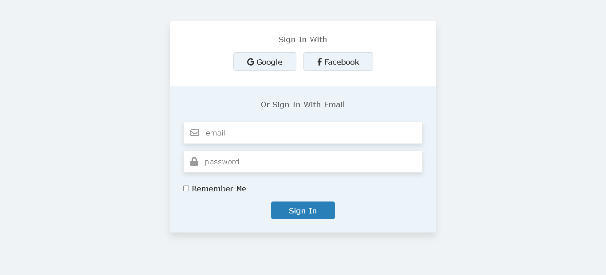

# Formulário de Login Responsivo com HTML e CSS




> Esse projeto é um formulário de login responsivo feito apenas com html e css.

## ☕ Usando Formulário de Login Responsivo com HTML e CSS
Para usar Formulário de Login, clique no link abaixo:

```
[![Abrir com Netlifly]](https://formulario-de-login.netlify.app/)
```

## 🤝 Colaborador

Agradecemos à seguinte pessoa que contribuíu para este projeto:

<table>
  <tr>
    <td align="center">
      <a href="https://github.com/gabomoreira">
        <br>
        <sub>
          <b>Gabriel Moreira</b>
        </sub>
      </a>
    </td>
  </tr>
</table>
